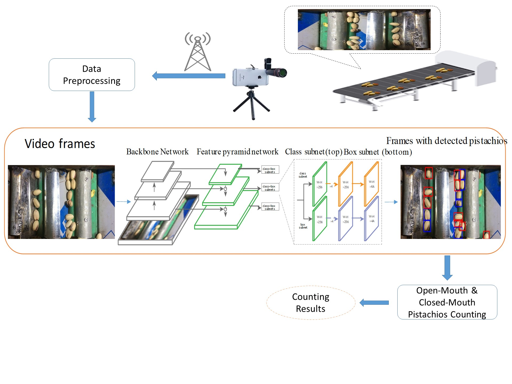
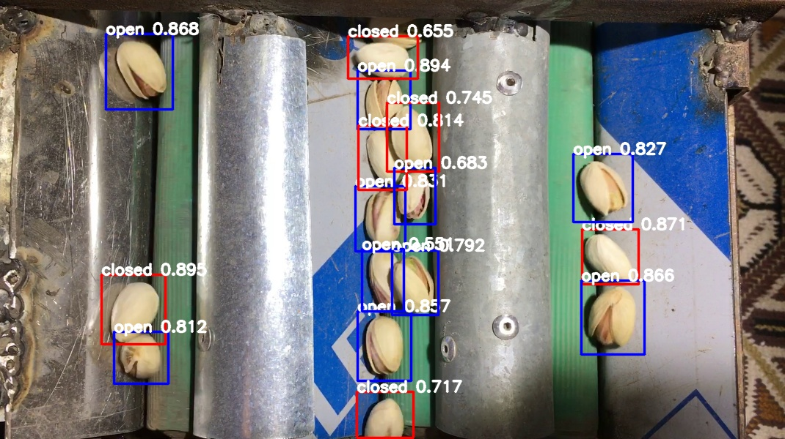
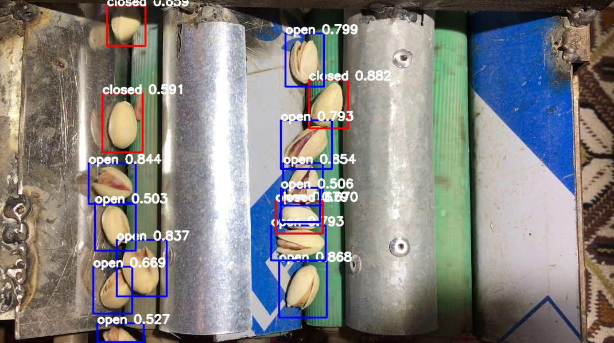
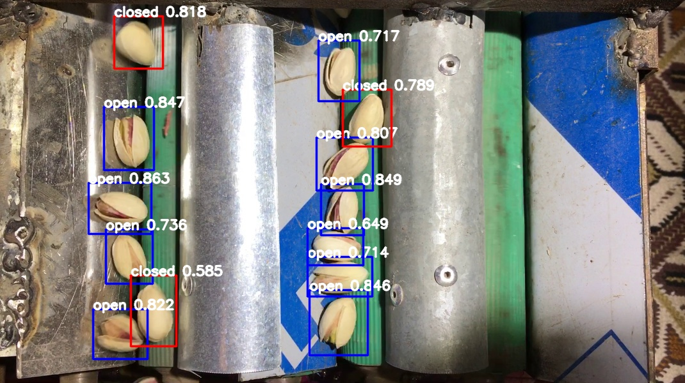
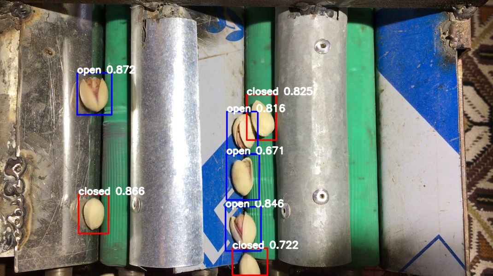
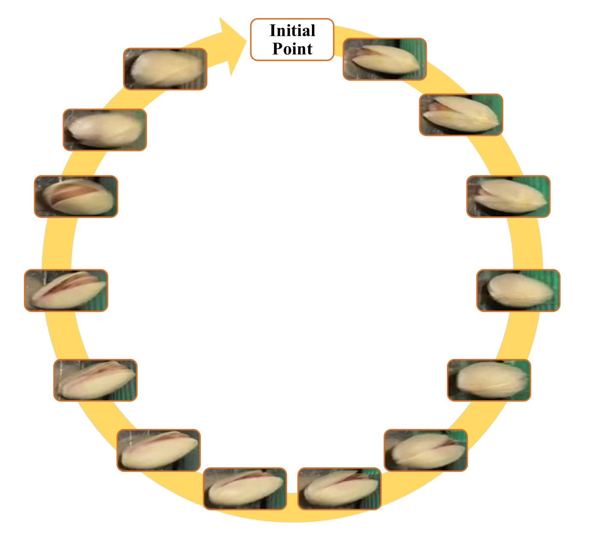

# Introduction of a new Dataset and Method for Detecting and Counting Pistachios based on Deep Learning

Pistachio is a nutritious nut that has many uses in the food industry. Iran is one of its largest producers, and pistachio is considered as a strategic export product for this country. This product has a great variety, most of which are cultivated in Iran and taken to other countries. Pistachios are sorted based on the shape of their shell into two categories: Open-mouth and Closed-mouth. The open-mouth pistachios are higher in price, value, and demand than the closed-mouth pistachios.
In the countries that are famous in pistachio production and exporting, there are companies that pack the picked pistachios from the trees and make them ready for exporting. As there are differences between the price and the demand of the open-mouth and closed-mouth pistachios, it is considerable for these companies to know precisely how much of these two kinds of pistachios exist in each packed package. In this paper, we have introduced and shared a new dataset of pistachios, which is called Pesteh-Set. This dataset is prepared by a company in Iran and has been recorded from a cell-phone camera above the line that transported the pistachios.
Pesteh-Set includes 6 videos with a total length of 167 seconds and 561 moving pistachios. It also contains 423 labeled images that totally include 3927 labeled pistachios. At the first stage, we have used RetinaNet, the deep fully convolutional object detector for detecting the pistachios in the video frames. In the second stage, we introduce our method for counting the open-mouth and closed-mouth pistachios in the videos. Pistachios that move and roll on the transportation line may appear as closed-mouth in some frames and as open-mouth in other frames. With this circumstance, the main challenge of our work is to count these two kinds of pistachios correctly and fast.
Our introduced method performs very fast with no need for GPU, and it also achieves good counting results. The computed accuracy of our counting method is 94.75%.
Our introduced methods can be remotely performed by using the videos taken from the implemented cameras that could monitor the pistachios.

Pesteh-set is available on https://github.com/mr7495/Pesteh-Set

# Detection
The main purpose of our paper was to count the open-mouth and closed-mouth pistachios in videos. At the first stage, we have to generate the frames of the video and detect the pistachios in them with RetinaNet.

We have separated the dataset into five-folds and allocated 20 percent of the dataset for validation and the rest for the training. After the detection phase, we present the method we used for counting the open-mouth and closed-mouth pistachios. This counting algorithm runs very fast with good accuracy.

<p align="center">
	
	<br>
	<em>The General View of our proposed method for counting the pistachios</em>
</p>

The images of the dataset were preprocessed and then resized to 1070×600 pixels.

We trained and validated RetinaNet on 3 different backbones: ResNet50, ResNet152, and VGG16. Transfer learning from the ImageNet pre-trained weights was utilized at the beginning of the training to speed up the network convergence. We also used data augmentation methods to improve the learning efficiency and stop the network from overfitting. The details of each fold are present is the next table.

Fold  | Training Images | Validation Images | Open-mouth Pistachios in Training Set | Closed-mouth Pistachios in Training Set | Open-mouth Pistachios in Validation Set | Closed-mouth Pistachios in Validation Set
------------ | ------------- | ------------- | ------------- | ------------- | ------------- | -------------
Fold1 | 339 | 84 | 1600 | 1550 | 393 | 384
Fold2 | 339 | 84 | 1610 | 1572 | 383 | 362
Fold3 | 339 | 84 | 1553 | 1506 | 440 | 428
Fold4 | 339 | 84 | 1641 | 1575 | 352 | 359
Fold5 | 336 | 87 | 1568 | 1533 | 425 | 401

**The code for training and evaluating the netwroks is availabe on [Pistachio_RetinaNet_Training_&_Evaluating](Pistachio_RetinaNet_Training_&_Evaluating.ipynb)**

**All the CSV annotation files(train & test) in each fold along all the images are shared in the [pesteh_set folder](pesteh_set) in this repository.**

Some of the detected images are shown in the next figures.

  
  

The open-mouth and the closed-mouth pistachios could look like each other in many cases like the next figure, and it would be hard to distinguish them even with human eyes. This may be the reason; the made results are not very high.

<p align="center">
	
	<br>
	<em>Some of the hard examples in Pesteh-Set</em>
</p>

This Table shows the average results of RetinaNet between five folds:

Backbone Network  | Recall | F1 score | map
------------ | ------------- | ------------- | -------------
ResNet50 | 93.44 | 92.05 | 91.87
ResNet152 | 93.36 | 91.99 | 91.69
VGG16 | 92.79 | 90.86 | 91.23

**All the trained networks in each fold can be used by this link:**

https://drive.google.com/open?id=1sc31RQK1tiA7gsgVL0PvudmBrOBn3USi

**The videos of Pesteh-Set are aslo available on Google Drive and Mendeley:**

https://drive.google.com/drive/folders/1ojq1maRM82o3Ee4cOUelNFKqTXda_ovs?usp=sharing<br /> 
https://data.mendeley.com/datasets/45hs5ht6k3/2

# Counting

The second and main phase of our work was counting the number of open-mouth and closed-mouth pistachios in the videos. To do so, first, we used a frame generator to extract the frames of the video, then we fed the frames to the object detector, and finally, we had a list of bounding boxes for each frame.

There were several challenges in this phase. The first challenge was that we wanted to develop a method that could be performed very fast on the CPU. Some of the other ideas may need a GPU; otherwise, the process would become extremely time-consuming. However, our method works very much fast on CPU, even faster than the methods that need to be executed on GPU.

The second challenge was that some of the open-mouth pistachios could show themselves as closed-mouth pistachio in some consecutive frames and then reveal their open part only a few frames.  Moreover, some open-mouth pistachios that are rolling on the transportation line could show their open part several times and then be appeared like closed-mouth pistachios like the next fig.  We had to develop our algorithm somehow to prevent failing because of these challenges. 

Another challenge is to develop the counting method in a way to prevent failure because of false detections or not-detected pistachios that may be affected by the pistachios occlusion.


<p align="center">
	
	<br>
	<em>In this figure you can observe that a pistachio can be presented as open-mouth and closed-mouth
several times while moving.</em>
</p>

**The developed counter code is accessable in [Counter.ipynb](Counter.ipynb) file in this repo.**
**The Full details and explaination of the counter algorithm is presented in the paper**

Here the obtained results of the counter algorithm for all the six videos are provided.
It must be noticed that here are the results of the trained networks in fold1.

Backbone Network  | Ground-Truth Open-Mouth Pistachios | Ground-Truth Closed-Mouth Pistachios  | Correctly Counted Open-Mouth Pistachios | Correctly Counted Closed-Mouth Pistachios | miscounted | Accuracy
------------ | ------------- | ------------- | ------------- | ------------- | ------------- | -------------
ResNet50 | 409| 152 | 397 | 145 | 11| 94.75
ResNet152 | 409| 152 | 386 | 152 | 24 | 91.96
VGG16 | 409| 152 | 395 | 149 | 37 | 90.96

**The paper is published as a pre-print on:**<br /> 
1-https://arxiv.org/abs/2005.03990

2-https://www.researchgate.net/publication/341180408_Introduction_of_a_new_Dataset_and_Method_for_Detecting_and_Counting_the_Pistachios_based_on_Deep_Learning?channel=doi&linkId=5eb2a80f299bf152d69dd252&showFulltext=true

If you find our work useful, you can cite it by:
```
@misc{rahimzadeh2020introduction,
    title={Introduction of a new Dataset and Method for Detecting and Counting the Pistachios based on Deep Learning},
    author={Mohammad Rahimzadeh and Abolfazl Attar},
    year={2020},
    eprint={2005.03990},
    archivePrefix={arXiv},
    primaryClass={cs.CV}
}
```

You can contact the developer by this email: mr7495@yahoo.com
